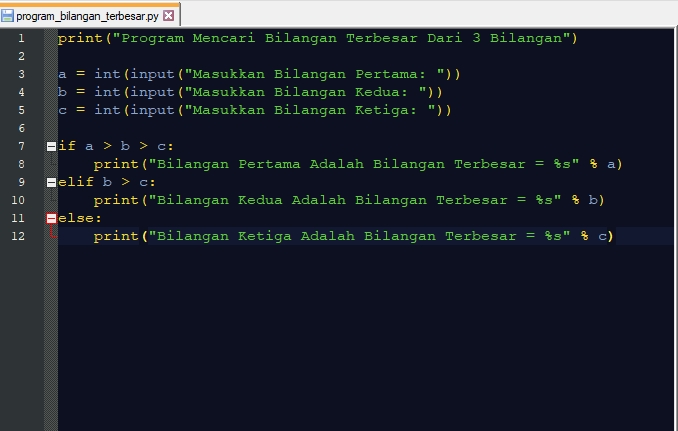
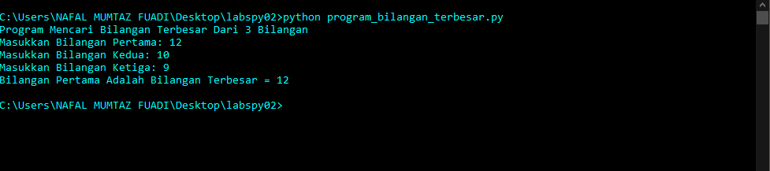
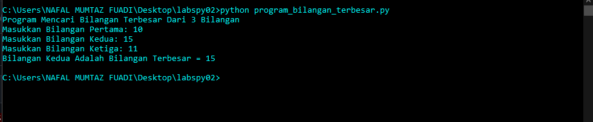
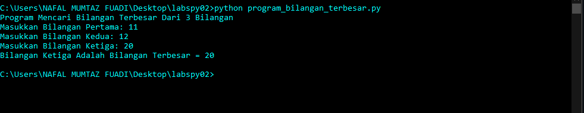

# Labspy02
## Algoritma untuk menentukan nilai terbesar dari 3 buah bilangan

# Flowchart

berikut flowchart untuk menentukan nilai terbesar dari 3 buah bilangan

# Menggunakan statement if untuk mencari nilai terbesar dari 3 bilangan

#### untuk a di inisiasikan sebagai bilangan pertama, b untuk bilangan kedua, c untuk bilangan ketiga

#### dengan cara statement if untuk a sebagai bilangan pertama, elif untuk b bilangan kedua, dan else untuk c bilangan ketiga, berikut gambar program dan tulisan programnya

#### untuk hasil ketika program dijalankan, bilangan pertama yang terbesar

#### untuk bilangan kedua yang terbesar ketika program dijalankan

#### sedangkan untuk bilangan ketiga yang terbesar ketika program dijalankan

